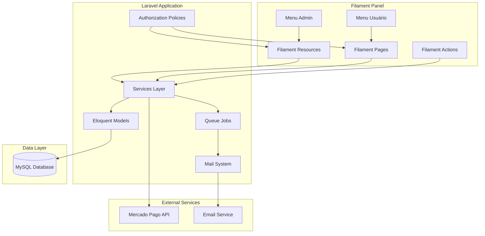
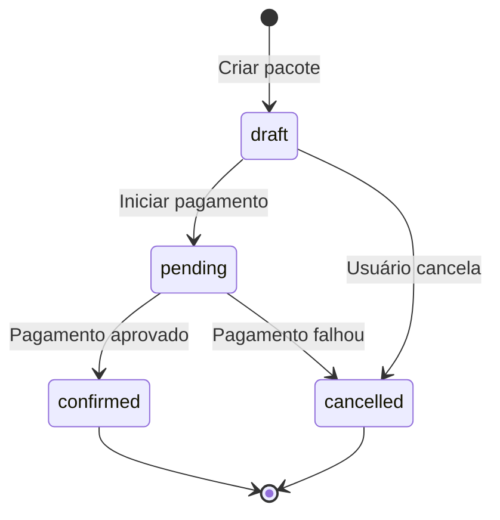

# Design Document

## Overview

O sistema de inscrições para eventos será desenvolvido usando Laravel 12 como framework backend, Filament 4.x como interface única para admin e usuários, e MySQL como banco de dados. A arquitetura utilizará os recursos de autorização do Filament para diferenciar acessos, com admin tendo menu completo de gerenciamento e usuários tendo acesso apenas às funcionalidades de inscrição e visualização de seus registros.

## Architecture

### High-Level Architecture



### Technology Stack

- **Backend Framework**: Laravel 12
- **UI Framework**: Filament 4.x (painel único para admin e usuários)
- **Database**: MySQL 8.0+
- **Payment Gateway**: Mercado Pago SDK
- **Queue System**: Laravel Queue (database driver)
- **Email**: Laravel Mail with SMTP
- **Authentication**: Filament Authentication (built-in)
- **Authorization**: Laravel Policies + Filament Navigation

## Components and Interfaces

### Database Schema

```mermaid
erDiagram
    users ||--o{ packages : creates
    users {
        bigint id PK
        string name
        string email UK
        string password
        string role
        timestamp email_verified_at
        timestamps
    }
    
    events ||--o{ payment_batches : has
    events ||--o{ registrations : has
    events {
        bigint id PK
        string name
        text description
        datetime event_date
        boolean is_active
        timestamps
    }
    
    payment_batches {
        bigint id PK
        bigint event_id FK
        decimal price
        date start_date
        date end_date
        timestamps
    }
    
    packages ||--o{ registrations : contains
    packages {
        bigint id PK
        string package_number UK
        bigint user_id FK
        string status
        decimal total_amount
        string payment_method
        string payment_id
        timestamps
    }
    
    registrations {
        bigint id PK
        bigint package_id FK
        bigint event_id FK
        string participant_name
        string participant_email
        string participant_phone
        text participant_data
        decimal price_paid
        timestamps
    }
```

### Core Models

#### User Model
```php
- Relationships: hasMany(Package)
- Attributes: name, email, password, role (admin/user)
- Methods: isAdmin(), packages()
```

#### Event Model
```php
- Relationships: hasMany(PaymentBatch), hasMany(Registration)
- Attributes: name, description, event_date, is_active
- Methods: getCurrentBatch(), paymentBatches(), registrations()
- Scopes: active()
```

#### PaymentBatch Model
```php
- Relationships: belongsTo(Event)
- Attributes: event_id, price, start_date, end_date
- Methods: isActive(), event()
- Scopes: active()
```

#### Package Model
```php
- Relationships: belongsTo(User), hasMany(Registration)
- Attributes: package_number, user_id, status, total_amount, payment_method, payment_id
- Status: draft, pending, confirmed, cancelled
- Methods: generatePackageNumber(), registrations(), user(), calculateTotal()
```

#### Registration Model
```php
- Relationships: belongsTo(Package), belongsTo(Event)
- Attributes: package_id, event_id, participant_name, participant_email, participant_phone, participant_data, price_paid
- Methods: package(), event()
```

### Service Layer

#### EventService
```php
- createEvent(array $data): Event
- updateEvent(Event $event, array $data): Event
- getActiveEvents(): Collection
- getCurrentPrice(Event $event): float
```

#### PaymentBatchService
```php
- createBatch(Event $event, array $data): PaymentBatch
- updateBatch(PaymentBatch $batch, array $data): PaymentBatch
- getActiveBatch(Event $event): ?PaymentBatch
- validateBatchDates(Event $event, array $data): bool
```

#### RegistrationService
```php
- createPackage(User $user): Package
- addRegistrationToPackage(Package $package, Event $event, array $data): Registration
- calculatePackageTotal(Package $package): float
- updatePackageStatus(Package $package, string $status): void
```

#### PaymentService
```php
- createPaymentPreference(Package $package, string $method): array
- processPaymentCallback(array $data): void
- confirmPayment(Package $package, string $paymentId): void
```

#### NotificationService
```php
- sendConfirmationEmail(Package $package): void
- sendPaymentReceiptEmail(Package $package): void
```

### Filament Structure

#### Filament Resources (Admin Only)

**EventResource**
- CRUD completo para eventos
- Relação com PaymentBatches inline
- Tabela com filtros e busca
- Visível apenas para role admin

**RegistrationResource**
- Listagem completa de todas as inscrições
- Filtros: evento, status, data, pacote, usuário
- Edição de inscrições
- Ações em massa (exportar, atualizar status)
- Visível apenas para role admin

**PackageResource**
- Visualização de todos os pacotes
- Detalhes de inscrições do pacote
- Filtros por status, usuário, data
- Visível apenas para role admin

#### Filament Pages (User Access)

**AvailableEventsPage**
- Lista eventos disponíveis para inscrição
- Cards com informações do evento e preço atual
- Botão "Inscrever-se" que abre modal
- Visível para todos os usuários autenticados

**RegistrationPage**
- Página de criação de inscrições
- Formulário para adicionar participantes
- Lista de inscritos adicionados (área inferior)
- Botão para adicionar mais inscrições
- Botão "Prosseguir para Pagamento"
- Visível para todos os usuários autenticados

**MyRegistrationsPage**
- Dashboard do usuário
- Lista de pacotes do usuário
- Cards clicáveis que abrem modal com detalhes
- Filtros por status e evento
- Visível para todos os usuários autenticados

**PaymentPage**
- Seleção de método de pagamento (PIX/Cartão)
- Resumo do pacote e valor total
- Integração com Mercado Pago
- Visível para todos os usuários autenticados

#### Filament Actions

**CreateRegistrationAction**
- Action modal para adicionar inscrição ao pacote
- Formulário com dados do participante
- Validação em tempo real

**ViewPackageDetailsAction**
- Action modal para exibir detalhes do pacote
- Lista todas as inscrições
- Exibe status de pagamento e informações do evento

**ProcessPaymentAction**
- Action para iniciar processo de pagamento
- Redireciona para Mercado Pago

#### Navigation Structure

**Admin Menu:**
- Dashboard
- Eventos (EventResource)
- Inscrições (RegistrationResource)
- Pacotes (PackageResource)
- Lotes de Pagamento (via EventResource relation manager)

**User Menu:**
- Meus Pacotes (MyRegistrationsPage)
- Eventos Disponíveis (AvailableEventsPage)
- Nova Inscrição (RegistrationPage - acessível via evento)

#### Authorization

**Policies**
- EventPolicy: apenas admin pode criar/editar/deletar
- RegistrationPolicy: admin pode tudo, usuário só visualiza próprias
- PackagePolicy: admin pode tudo, usuário só visualiza próprios

**Navigation Visibility**
```php
// EventResource
public static function canViewAny(): bool
{
    return auth()->user()->isAdmin();
}

// MyRegistrationsPage
public static function canAccess(): bool
{
    return auth()->check();
}
```

### Routes Structure

```php
// Filament handles all authenticated routes at /admin
// Navigation and access control via Filament configuration

// Additional custom routes for payment integration
Route::middleware(['auth'])->group(function () {
    Route::post('/payment/process/{package}', [PaymentController::class, 'process'])
        ->name('payment.process');
});

// Payment callback (public - webhook do Mercado Pago)
Route::post('/payment/callback', [PaymentController::class, 'callback'])
    ->name('payment.callback');

// Redirect root to Filament
Route::get('/', function () {
    return redirect('/admin');
});
```

## Data Models

### Package Number Generation

O número do pacote será gerado usando o seguinte formato:
- Formato: `PKG-{YEAR}{MONTH}{DAY}-{RANDOM}`
- Exemplo: `PKG-20241114-A7B9C2`
- Implementação: UUID ou combinação de timestamp + random string

### Status Flow



### Payment Data Structure

```json
{
  "package_id": 123,
  "amount": 150.00,
  "method": "pix",
  "items": [
    {
      "title": "Inscrição - Nome do Evento",
      "quantity": 2,
      "unit_price": 75.00
    }
  ],
  "payer": {
    "email": "user@example.com",
    "name": "Nome do Usuário"
  }
}
```

## Error Handling

### Validation Rules

**Event Creation**
- name: required, string, max:255
- description: required, string
- event_date: required, date, after:today
- is_active: boolean

**Payment Batch Creation**
- event_id: required, exists:events,id
- price: required, numeric, min:0
- start_date: required, date
- end_date: required, date, after:start_date
- Validação customizada: datas não podem sobrepor outros lotes

**Registration Creation**
- participant_name: required, string, max:255
- participant_email: required, email
- participant_phone: required, string
- event_id: required, exists:events,id

### Exception Handling

**PaymentException**
- Lançada quando pagamento falha
- Log do erro
- Notificação ao usuário
- Manter pacote em estado pending

**BatchOverlapException**
- Lançada quando datas de lotes se sobrepõem
- Retornar erro de validação ao admin

**InvalidPackageStateException**
- Lançada quando operação não é permitida no estado atual
- Exemplo: tentar pagar pacote já confirmado

### Error Responses

```php
// API/AJAX responses
{
    "success": false,
    "message": "Mensagem de erro amigável",
    "errors": {
        "field": ["Erro específico do campo"]
    }
}
```

## Testing Strategy

### Unit Tests

**Model Tests**
- Package::generatePackageNumber() gera número único
- Package::calculateTotal() calcula corretamente
- PaymentBatch::isActive() retorna status correto
- Event::getCurrentBatch() retorna lote ativo

**Service Tests**
- PaymentBatchService::validateBatchDates() valida sobreposição
- RegistrationService::calculatePackageTotal() calcula total
- PaymentService::createPaymentPreference() cria preferência válida

### Feature Tests

**Registration Flow**
- Usuário pode criar inscrição individual
- Usuário pode adicionar múltiplas inscrições
- Pacote é criado com número único
- Status inicial é draft

**Payment Flow**
- Usuário pode selecionar método de pagamento
- Redirecionamento para Mercado Pago funciona
- Callback atualiza status corretamente
- Email é enviado após confirmação

**Admin Panel**
- Admin pode criar eventos
- Admin pode adicionar lotes
- Admin pode visualizar e filtrar inscrições
- Admin pode editar inscrições

### Integration Tests

**Mercado Pago Integration**
- Mock da API do Mercado Pago
- Testar criação de preferência
- Testar processamento de callback
- Testar diferentes status de pagamento

**Email Integration**
- Testar envio de email de confirmação
- Verificar conteúdo do email
- Testar falhas de envio

## Security Considerations

### Authentication & Authorization

- Middleware de autenticação em todas as rotas protegidas
- Role-based access control (admin vs user)
- Filament protegido por middleware de admin
- Usuários só podem acessar seus próprios pacotes

### Payment Security

- Validação de callbacks do Mercado Pago usando assinatura
- Armazenar apenas referência do pagamento, não dados sensíveis
- HTTPS obrigatório em produção
- Tokens CSRF em todos os formulários

### Data Protection

- Senhas hasheadas com bcrypt
- Validação de entrada em todos os endpoints
- Proteção contra SQL injection (Eloquent ORM)
- Rate limiting em rotas públicas

## Performance Considerations

### Database Optimization

- Índices em colunas frequentemente consultadas:
  - users.email
  - packages.package_number
  - packages.user_id
  - registrations.package_id
  - registrations.event_id
  - payment_batches.event_id

### Caching Strategy

- Cache de eventos ativos (5 minutos)
- Cache de lote ativo por evento (5 minutos)
- Invalidar cache ao criar/atualizar eventos ou lotes

### Queue Jobs

- Envio de emails em background
- Processamento de callbacks de pagamento
- Geração de relatórios

## Filament-Specific Implementation Details

### Custom Filament Widgets

**UserDashboardWidget**
- Exibe resumo de pacotes do usuário
- Estatísticas: total de inscrições, eventos confirmados, pendentes
- Visível apenas para usuários não-admin

**AdminStatsWidget**
- Estatísticas gerais do sistema
- Total de eventos, inscrições, receita
- Visível apenas para admin

### Filament Table Customizations

**RegistrationResource Table**
- Colunas: ID, Pacote, Evento, Participante, Email, Status, Data
- Filtros: Evento, Status, Data, Pacote
- Ações: Editar, Visualizar Pacote, Enviar Email
- Bulk Actions: Exportar CSV, Atualizar Status

**PackageResource Table**
- Colunas: Número, Usuário, Total, Status, Método Pagamento, Data
- Filtros: Status, Método Pagamento, Data
- Ações: Visualizar Detalhes, Reenviar Email

### Filament Form Customizations

**Event Form**
- Seção: Informações Básicas (nome, descrição, data)
- Seção: Configurações (is_active)
- Relation Manager: Payment Batches (inline)

**Registration Form (Modal)**
- Campo: Nome do Participante (required)
- Campo: Email do Participante (required, email)
- Campo: Telefone do Participante (required, mask)
- Campo: Dados Adicionais (textarea, optional)
- Campo Hidden: Event ID, Package ID

### Filament Notifications

- Sucesso ao adicionar inscrição
- Erro ao processar pagamento
- Confirmação de pagamento recebida
- Email enviado com sucesso

## Deployment Considerations

### Environment Variables

```env
APP_URL=https://example.com
DB_CONNECTION=mysql
DB_HOST=127.0.0.1
DB_PORT=3306
DB_DATABASE=event_registration
DB_USERNAME=root
DB_PASSWORD=

MERCADOPAGO_PUBLIC_KEY=
MERCADOPAGO_ACCESS_TOKEN=

MAIL_MAILER=smtp
MAIL_HOST=smtp.mailtrap.io
MAIL_PORT=2525
MAIL_USERNAME=
MAIL_PASSWORD=
MAIL_FROM_ADDRESS=noreply@example.com
```

### Migration Strategy

1. Criar migrations na ordem correta (users, events, payment_batches, packages, registrations)
2. Seeders para dados iniciais (admin user, eventos de exemplo)
3. Rollback plan documentado

### Monitoring

- Log de erros de pagamento
- Monitorar taxa de sucesso de pagamentos
- Alertas para falhas de email
- Monitorar performance de queries
